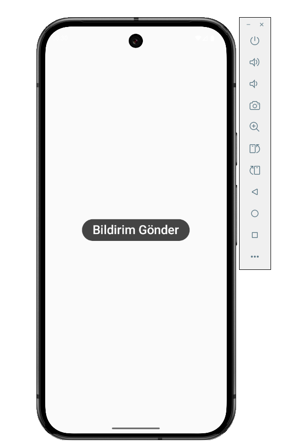
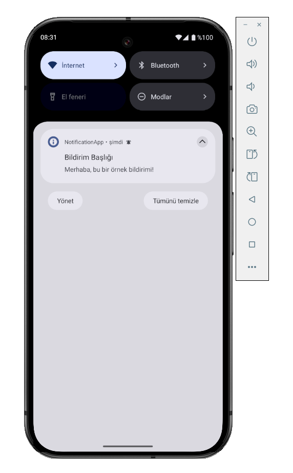

# Jetpack Compose ile Android Bildirim Gönderme (NotificationApp)

Bu projede Jetpack Compose kullanılarak Android uygulamasında **tek tuşla bildirim gönderimi** (local notification) örneği sunulmaktadır.

## Özellikler
- Ekranın ortasında bir buton
- Butona tıklanınca önce ekranda kısa bir Toast mesajı çıkar, ardından bildirim paneline örnek bildirim gönderilir
- Android 13+ için otomatik bildirim izni sorgusu
- Temiz ve sade Compose kodu

## Kurulum ve Kullanım
1. Kodu indir veya klonla  
   `git clone https://github.com/AbdulkadirEkrem/NotificationApp.git`
2. Android Studio ile aç
3. Uygulamayı başlat, "Bildirim Gönder" butonuna tıkla
4. Bildirim panelinden sonucu gör

## Ekran Görüntüleri

## Katkı ve Lisans
Dilediğiniz gibi kullanabilir, geliştirebilir veya kendi projelerinizde örnek olarak kullanabilirsiniz.  
Her türlü soru ve öneriniz için iletişim: [LinkedIn](https://www.linkedin.com/in/abdulkadirekrem/)

---

# Android Notification Example with Jetpack Compose (NotificationApp)

This project is a simple **local notification** example using Jetpack Compose in an Android application.

## Features
- A button centered on the screen
- When the button is clicked, first a Toast message is shown, then a notification is sent to the notification panel
- Automatic notification permission check for Android 13+
- Clean and simple Compose code

## Installation & Usage
1. Download or clone the code  
   `git clone https://github.com/AbdulkadirEkrem/NotificationApp.git`
2. Open with Android Studio
3. Run the app, click the "Bildirim Gönder" button
4. See the result in the notification panel

## Screenshots

## License & Contribution
Feel free to use, improve, or reference in your own projects.  
For any questions or suggestions, contact: [LinkedIn](https://www.linkedin.com/in/abdulkadirekrem/)

---

> _Kısa ve sade bir örnek isteyenler için hızlı bir başlangıç projesidir._  
> _A quick-start project for those who want a simple example._
